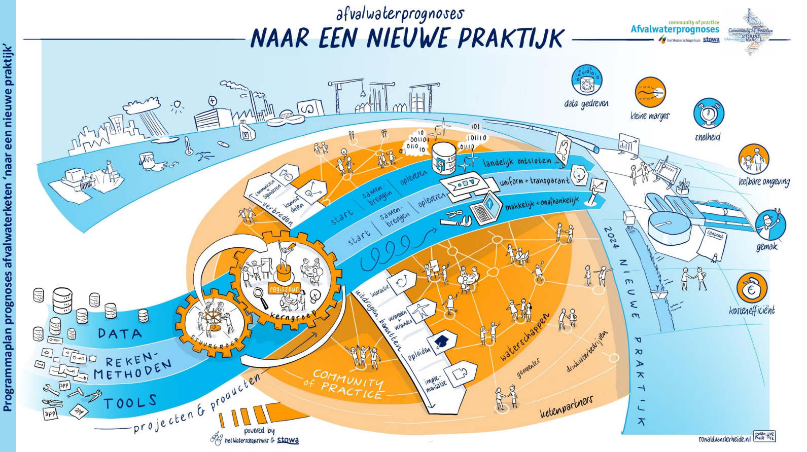
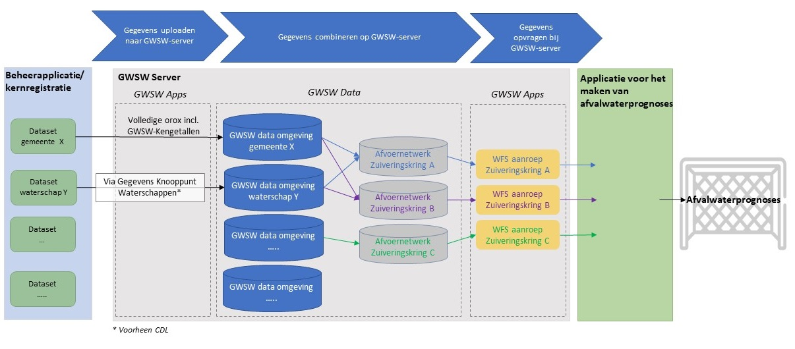
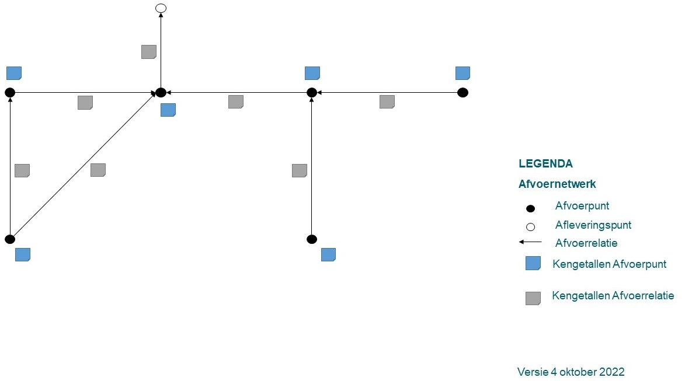
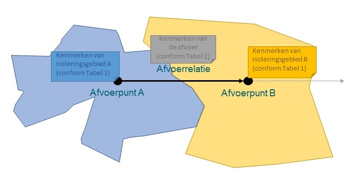
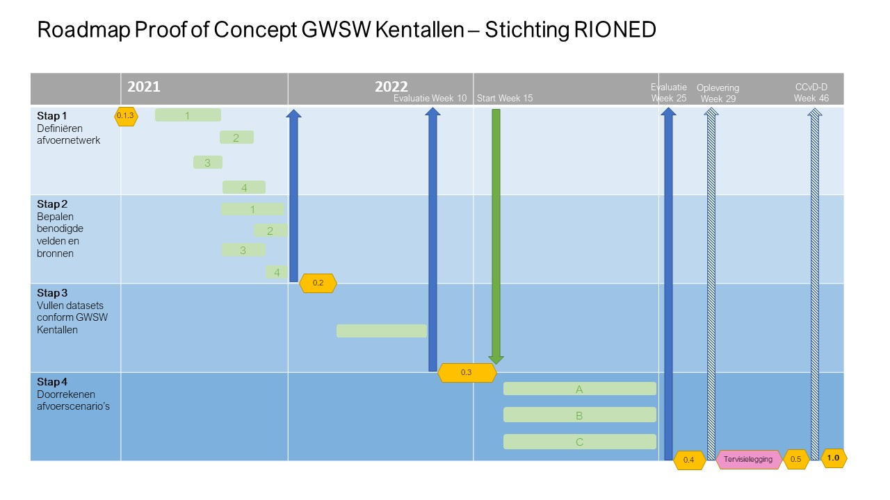
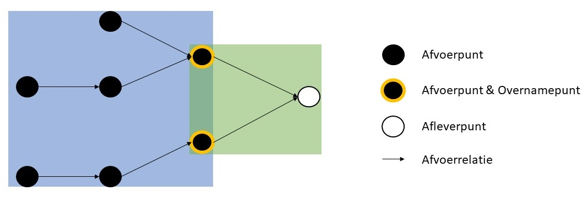
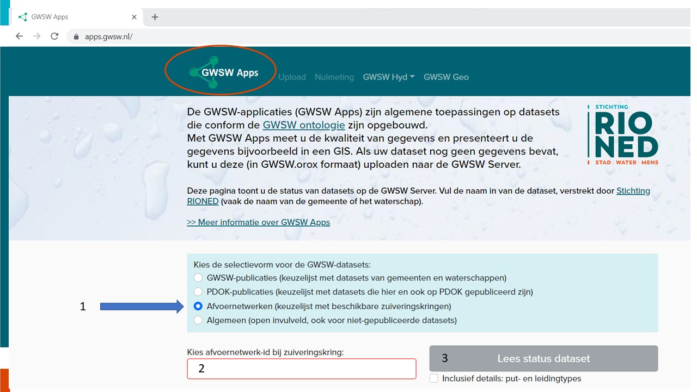
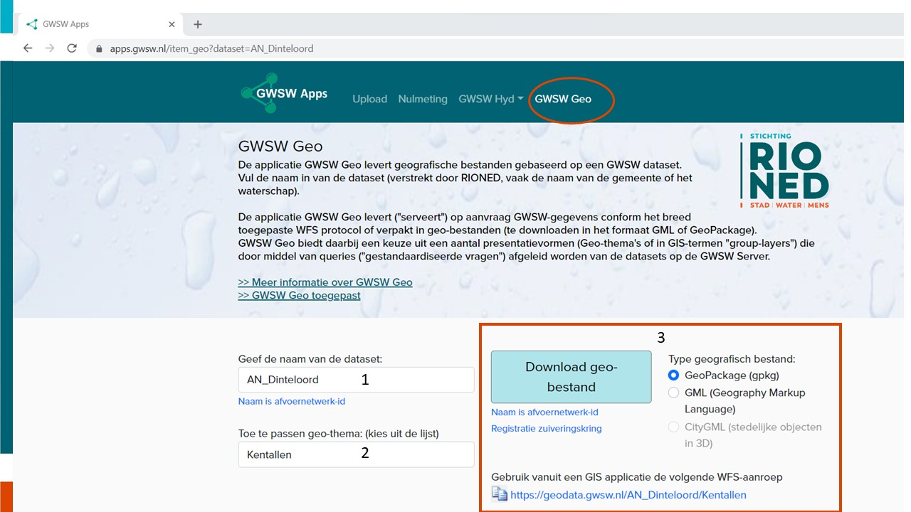

# GWSW Kengetallen

**LET OP: OP KORTE TERMIJN WORDT DEZE PAGINA UITGEBREID EEN GEBRUIKERSHANDLEIDING EN AANGEVULD MET DE GELEERDE LESSEN DOOR GEBRUIKERS.**

De module GWSW-Kengetallen is ontwikkeld door Jordie Netten (Nelen & Schuurmans, thans Netten Wateradvies), in samenwerking met de werkgroep GWSW-Kengetallen, bestaande uit:
- Marco van Bijnen, Duopp 
- Wim de Blecourt, Waterschap Drents en Overijsselse Delta
- André Hammenga, Waterschap Hunze en Aa’s
- Marianne Kruger, Duopp 
- Mark Lamers, Hoogheemraadschap Hollands Noorderkwartier
- Johan Post, Partners4UrbanWater
- Wouter van Riel, Infralytics
- Guido Schaepman, Hoogheemraadschap van Rijnland 
- Dirk Smolenaars, Waterschapsbedrijf Limburg
- Fred Tacke, Waterschap Rijn en IJssel 
- Wijnand Turkensteen, Waterschap Aa en Maas
- Marc van der Wulp, Waterschap Hollandse Delta

Vanuit Stichting RIONED is Eric Oosterom de verantwoordelijk projectmanager. Vragen over de concept-module en de totstandkoming en vaststelling ervan kunt u stellen via gwsw@rioned.org. 

Gelieve de inhoudsopgave als leeswijzer te beschouwen.

# Inleiding

Kengetallen van rioolstelsels en rioleringsgebieden en afvoerrelaties tussen stelsels en gebieden zijn essentieel voor het opstellen van afvalwaterprognoses. Om deze informatie bij elkaar te krijgen, is vaak een forse inspanning nodig. De benodigde gegevens zijn in beheer bij gemeenten en waterschappen. Daar worden de gegevens op verschillende plekken en in verschillende formaten opgeslagen. Door gebruik te maken van gestandaardiseerde open data en eenduidige terminologie is het mogelijk om op een efficiënte en vergelijkbare wijze de afvoerrelaties en kengetallen te beschrijven en uit te wisselen. Dit vereenvoudigt en verbetert het opstellen van afvalwaterprognoses.

De afkorting GWSW staat voor GegevensWoordenboek Stedelijk Water, de open standaard waar Stichting RIONED met alle relevante partijen aan werkt. Met het GWSW worden komende jaren alle objecten en hun gegevens, hun onderlinge relaties, en de beheeractiviteiten binnen het domein stedelijk water eenduidig gedefinieerd en vastgelegd ten behoeve van soepele gegevensuitwisseling en beter beheer. Meer informatie daarover vindt u via [www.riool.net/gwsw](https://www.riool.net/gwsw).

De riolering en een deel van de afvalwaterketen kan al worden beschreven met het GWSW (Basis, Rib en Hyd). In het GWSW ontbreekt echter de schematisering van het afvoernetwerk en de bijbehorende kengetallen. Vanuit de Community of Practice ‘Afvalwaterprognoses’ van de STOWA is aan Stichting RIONED gevraagd om het GWSW geschikt te maken om als bron te dienen voor het doorrekenen van afvoerscenario’s in de afvalwaterketen. Dit wordt beschreven in GWSW-Kengetallen.

De algemene beschrijving van het GWSW model vindt u op [data.gwsw.nl](https://data.gwsw.nl/). De datamodellen GWSW-Basis (operationeel beheer), GWSW-Rib (inspectie en reiniging van leidingen, putten en kolken) en GWSW-Hyd (hydraulische modellering) zijn al eerder vastgestelde onderdelen van het GWSW. De tools rondom GWSW vindt u op [apps.gwsw.nl](https://apps.gwsw.nl). Voor de details van het datamodel GWSW-Kengetallen, zie [data.gwsw.nl/Kentallen](https://data.gwsw.nl/Kentallen).

# Gegevensuitwisseling t.b.v. afvalwaterprognoses

## Inleiding

Het verzamelen van gegevens voor het doen van afvalwaterprognoses is vaak tijdrovend, omdat deze in verschillende formaten en bij verschillende partijen in beheer zijn. De beheerapplicaties van gemeenten en de kernregistraties van waterschappen (Damo-AWK) zijn daarvoor een belangrijke bron. Afvoerscenario’s worden daarna op verschillende manieren en met verschillende applicaties afgeleid. Dergelijke afvoerscenario's geven inzicht in de huidige en toekomstige belasting van, rioolgemalen, persleidingen en zuiveringsinstallaties en is belangrijk voor het optimaliseren van de afvalwaterketen.

### Programmaplan 'Afvalwaterprognoses - Naar een nieuwe praktijk'

Het verzamelen van gegevens voor het doen van afvalwaterprognoses is een complex proces. Het Waterschapshuis heeft dit samen met STOWA als Community of Practice Afvalwaterprognoses opgenomen in het [programmaplan 2022-2024](https://www.stowa.nl/sites/default/files/assets/PROJECTEN/Projecten%202023/Afvalwaterprognoses%202022/Prognoses%20Afvalwaterketenprogrammaplan%202.0_Update%204mei22.pdf) (Figuur 1).

*Figuur 1 - Afvalwaterprognoses naar een nieuwe praktijk (Bron: Het Waterschapshuis/STOWA)*  

## Gegevensstromen en gereedschappen rond het GWSW

Nu al worden door veel gemeenten en waterschappen de gegevens van rioolstelsels en afvoersystemen op de GWSW Server gepubliceerd. Deze gegevens komen 1) via de upload functionaliteit van de GWSW Server middels een OroX (.ttl) bestand vanuit het gemeentelijke beheerpakket of 2) via het GegevensKnooppunt Waterschappen (Het Waterschapshuis) terecht in de dataomgeving van de betreffende organisatie op de GWSW Server. 

De module GWSW-Kengetallen ondersteunt in de gegevensuitwisseling ten behoeve van het maken van afvalwaterprognoses. Het is dus van belang dat de OroX (gemeentelijk rioleringsbeheerpakket) en Damo-AWK (waterschapsdata) deze gegevens conform het datamodel GWSW-Kengetallen aan kunnen leveren. 

Op de GWSW-server worden de gegevens van de verschillende organisatie gecombineerd in een afvoernetwerk per zuiveringskring. Met de applicatie GWSW-Geo kan via het geo-thema Kengetallen de WFS-aanroep worden gegenereerd of een geobestand (geopackage / GML) worden gedownload, waarmee de applicatie voor het maken van afvalwaterprognoses de invoergegevens ontvangt. 

In Figuur 2 staan de gegevensstromen en gereedschappen weergegeven die gebruikt worden voor het maken van afvalwaterprognoses met GWSW-Kengetallen.

*Figuur 2 - Gegevensstromen en gereedschappen voor het maken van afvalwaterprognoses*  

# Datamodel GWSW-Kengetallen

## Afvoernetwerk

Zie [data.gwsw.nl/Kentallen/Afvoernetwerk](https://data.gwsw.nl/Kentallen/Afvoernetwerk)

Binnen een zuiveringskring vormen rioleringsgebieden, rioolstelsels (vrijverval en mechanisch) en de zuivering samen met verschillende type leidingen een afvoernetwerk. Dit netwerk bestaat uit knooppunten (afvoerpunten) en verbindingen (afvoerrelaties).

In GWSW-Kengetallen wordt dit netwerk topologisch geschematiseerd (Figuur 3). Dat betekent dat het netwerk zonder geografische kenmerken kan worden gepresenteerd. Kenmerken die relevant en specifiek zijn voor het afvoerpunt of de afvoerrelatie worden aan dit netwerk gekoppeld. 

*Figuur 3 - Afvoernetwerk in GWSW-Kengetallen*

## Afvoerpunt  

Zie [data.gwsw.nl/Kentallen/Afvoerpunt](https://data.gwsw.nl/Kentallen/Afvoerpunt)

Een *Afvoerpunt* is de topologische vertaling van de zuivering (met subtype *Afleveringspunt*) en van rioleringsgebieden, opvoergemalen, tussengemalen, boostergemalen of andere fysieke constructies (met subtype *Afvoerpunt gebied*). Daardoor is het mogelijk het afvoernetwerk ook op kaart te visualiseren. De kengetallen van een stelsel of gebied worden gekoppeld aan het betreffende afvoerpunt. 

Een *Afleveringspunt* is deel van *Afvoernetwerk* en *RWZI*. Voor een *Afleveringspunt* zijn geen specifieke kenmerken nodig.

Een *Afvoerpunt gebied* is deel van *Afvoernetwerk*, *Gebied*, *Gemaal*, *Leiding*, *Put*, *Rioleringsgebied*, *Stelsel* en *Systeem*. Een *Afvoerpunt gebied* kan onderdeel zijn van een fysieke afvoerconstructie (zoals een rioolgemaal, stuwput, leiding), maar dat is niet verplicht. In de meeste gevallen zal een rioolgemaal het afvoerpunt van een stelsel of gebied zijn. 

Voor *Afvoerpunt gebied* zijn de volgende kenmerken mogelijk:

**DWA-belasting**
- Aantal inwoners - Totaal aantal inwoners in het gebied.
- Aantal woningen - Totaal aantal woningen in het gebied.
- Aantal v.e. - Aantal vervuilingseenheden. Bij uitwisseling van kengetallen alleen vullen als één of meer details (Aantal v.e. inwoners, Aantal v.e. bedrijven, Aantal v.e. recreatie) onbekend zijn.
- Aantal v.e. inwoners - Aantal vervuilingseenheden afkomstig van inwoners.
- Aantal v.e. bedrijven - Aantal vervuilingseenheden afkomstig van bedrijven.
- Aantal v.e. recreatie - Aantal vervuilingseenheden afkomstig van recreatie.
- DWA debiet - Totaal DWA debiet in m3/uur. Bij uitwisseling van kengetallen alleen vullen als één of meer details (DWA debiet inwoners, DWA debiet bedrijven, DWA debiet recreatie) onbekend zijn.
- DWA debiet inwoners - DWA debiet in m3/uur afkomstig van inwoners. 
- DWA debiet bedrijven - DWA debiet in m3/uur afkomstig van bedrijven.
- DWA debiet recreatie - DWA debiet in m3/uur afkomstig van recreatie.

**HWA-belasting**
- Afvoerend oppervlak - Het oppervlak in m2 van de bovenlaag dat water afvoert naar het object.

**Berging**  
- Maatgevend niveau voor berging - De hoogte (in m t.o.v. NAP) op basis waarvan de stelselberging is bepaald. Het maatgevende niveau ten opzichte van een referentiepeil.
- Netto berging - De netto onderdrempelberging (in m3), ook wel de statische berging genoemd. Rekening houdend met het bergingsverlies vanwege permanente vulling.
- Netto berging randvoorzieningen - De netto onderdrempelberging in randvoorzieningen (in m3), ook wel de statische berging genoemd. Rekening houdend met het bergingsverlies vanwege permanente vulling.
- Verloren berging - De inhoud (in m3 van de riolering dat blijvend is gevuld en niet bijdraagt aan de effectieve berging.
- Vultijd - De tijd (in uur) waarin de riolering zich vult, vanaf het moment van uitschakeling gemaal tot het moment van uitstromen van afvalwater.
- Ledigingstijd - De tijd (in uur) die een rioolgemaal nodig heeft om een vol gevuld rioolstelsel te ledigen bij niet opeenvolgende buien in een rioleringsgebied.

**Volumes**
- Afvoercapaciteit - De capaciteit (in m3/uur) van de fysieke afvoerconstructie bij het *Afvoerpunt gebied*. Hierbij kan via *Wijze van Afleiden* gekozen worden voor *Capaciteit geïnstalleerd*, *Gemeten capaciteit*, *Normcapaciteit* of *Ontwerpcapaciteit*.
- Pompovercapaciteit - Het deel van de capaciteit van een rioolgemaal (in m3/uur) dat beschikbaar is voor de afvoer van ingezamelde neerslag. Hierbij kan via *Wijze van Afleiden* gekozen worden voor *Capaciteit geïnstalleerd*, *Gemeten capaciteit*, *Normcapaciteit* of *Ontwerpcapaciteit*.
- Invoer gebied - Som van alle invoeren (in m3/uur) van inprikkende gebieden en bovenstroomse afvoerconstructies. Dit veld kan ter controle worden ingevuld. De automatische berekening wordt in de prognosesoftware gedaan en niet op de GWSW-server. 

## Afvoerrelatie

Zie [data.gwsw.nl/Kentallen/Afvoerrelatie](https://data.gwsw.nl/Kentallen/Afvoerrelatie)

Een *Afvoerrelatie* is de topologische verbinding tussen twee afvoerpunten, te weten het beginpunt en het eindpunt van de afvoerrelatie. De afvoer kan onder vrijverval (met subtype *Afvoerrelatie vrijverval*) of mechanisch (met subtype *Afvoerrelatie mechanisch*) plaatsvinden.

Voor *Afvoerrelatie* zijn de volgende kenmerken mogelijk:
- Afvoer DWA-situatie - DWA-debiet inclusief invoerend DWA-debiet in m3/uur. Hierbij kan via *Wijze van inwinning* gekozen worden voor o.a. *Afvalwaterakkoord* of *Debietmeter*.
- Afvoer HWA-situatie - Dit is de gesommeerde afvoer in m3/uur van DWA-debiet, pompovercapaciteit en invoeren. Hierbij kan via *Wijze van inwinning* gekozen worden voor o.a. *Afvalwaterakkoord* of *Debietmeter*.

## Voorbeeld
In Figuur 4 is een voorbeeld opgenomen van een topologisch netwerk.

*Figuur 4 - Voorbeeld van topologisch afvoernetwerk*

Rioleringsgebied A wordt in het topologische netwerk afvoerpunt A. Afvoerpunt A krijgt de kenmerken van rioleringsgebied A. Rioleringsgebied A voert af naar rioleringsgebied B. Rioleringsgebied B wordt in het topologische netwerk afvoerpunt B, met bijbehorende kenmerken. De afvoer tussen rioleringsgebied A (als afvoerpunt A) en rioleringsgebied B (als afvoerpunt B) is de afvoerrelatie.

# Totstandkoming GWSW-Kengetallen

Het GegevensWoordenboek Stedelijk Water (GWSW) is ontwikkeld onder de vlag van en wordt beheerd door Stichting RIONED. De Community of Practice Afvalwaterprognoses van de STOWA heeft in 2020 aan Stichting RIONED gevraagd om het GWSW geschikt te maken voor de uitwisseling van gegevens ten behoeve van afvalwaterprognoses. Hierop is Stichting RIONED begonnen met de ontwikkeling van GWSW-Kengetallen. 

Hiervoor is een [werkgroep](https://stichtingrioned.github.io/GWSW_Kentallen/#inleiding)) samengesteld met potentiële gebruikers vanuit verschillende waterschappen/samenwerkingsverbanden. Tevens is vanuit Stichting RIONED een projectteam samengesteld voor de technische realisatie van GWSW-Kengetallen. 
Via een aantal praktijktoetsen ("proof of concepts") is gekomen tot de huidige conceptversie van GWSW-Kengetallen. De gevolgde roadmap (Figuur 6) richt zich op publicatie per januari 2023 van GWSW versie 1.6.

*Figuur 6 - Roadmap van de praktijktoetsen tot aan beoogde publicatie*

In de "Proof of Concept" zijn de volgende stappen doorlopen:

## Stap 1: Definiëren afvoernetwerk van een zuiveringskring

Tussen waterschap en gemeentes zijn afspraken nodig over de opbouw van het afvoernetwerk:

- Welke rioleringsgebieden (clusters van stelsels) onderscheiden we en wat zijn daarvan de afvoerpunten?
- Welke stelsels (mechanisch en vrijverval) worden met een apart afvoerpunt beschreven?
- Welke overige afvoerpunten (als representatie van een afleveringspunt, rioolgemalen) onderscheiden we?
- Van welke fysieke afvoerconstructie (zoals een rioolgemaal, stuwput, leiding) is het afvoerpunt onderdeel van?
- Wat zijn de resulterende afvoerrelaties (verbindingen van de afvoerpunten)?

Een afvoernetwerk bestaat doorgaans uit afvoerpunten en -relaties van één of meerdere gemeenten en uit afvoerpunten en -relaties van een waterschap (Figuur 7). Een zuiveringskring kan beschreven worden als afvoernetwerk. Er zal in het definiëren van het afvoernetwerk specifieke aandacht moeten zijn voor de 'overnamepunten'. Dit geldt voor:
- Uit de praktijk blijkt dat een gemeente het eindgemaal van een kern vaak in het beheerpakket heeft zitten, terwijl deze in eigendom en beheer van het waterschap is. Om de juiste kengetallen (vanuit het waterschap) mee te geven binnen GWSW-Kengetallen zal hier het waterschap als *Gegevenseigenaar* moeten worden opgegeven.
- Om het gemeentelijke afvoernetwerk goed te laten aansluiten op het afvoernetwerk van het waterschap moeten de ID's van de 'overnamepunten' in beide datasets gelijk zijn.

*Figuur 7 - Voorbeeld van gemeentelijk afvoernetwerk (blauw vlak) en afvoernetwerk van het waterschap (groen vlak)*

## Stap 2: Bepalen van de benodigde velden en bronnen om die velden te vullen

Nadat het afvoernetwerk was gedefinieerd is door de werkgroep en het projectteam bepaald:

- Welke kenmerken er voor de verschillende type afvoerpunten en afvoerrelaties beschikbaar moeten zijn voor het doorrekenen van afvoerscenario's?
- Op welke wijze die kenmerken het beste kunnen worden beschreven in GWSW-Kengetallen?
- Welke brongegevens daarvoor gebruikt kunnen worden? Als bronnen kan gedacht worden aan:
  - Beheersystemen
  - GIS
  - Hydrodynamische rekenmodellen voor vrijverval rioolstelsels
  - Rapportages (analoog/digitaal)

Stap 1 en 2 zijn door vier regio's verspreid over Nederland (HH Rijnland, HHNK, Zuid-Limburg en Groningen) zelfstandig uitgevoerd op verzoek van en in afstemming met Stichting RIONED. Op 13 april 2021 is er een evaluatie met de betrokkenen geweest. Het resultaat daarvan was het eerste concept van het datamodel GWSW-Kengetallen.

## Stap 3: Vullen dataset conform GWSW-Kengetallen

Doel van deze stap was om de technische uitwisseling van de gegevens in GWSW-Kengetallen te toetsen. Krijgen we de gegevens op de GWSW-server en krijgen we er die ook weer vanaf? De Community of Practice Afvalwaterprognoses (STOWA) heeft DUOPP gevraagd om in samenwerking met het projectteam van Stichting RIONED deze dataomgeving te vullen met een afvoernetwerk en bijbehorende kenmerken, en daarna de gegevens te ontsluiten op zuiveringskringniveau conform GWSW-Kengetallen. Als casussen zijn de zuiveringskringen van Heusden/Waterschap Aa en Maas en Edam-Volendam/HHNK gebruikt.

Na Stap 3 is er op 10 maart 2022 een evaluatie geweest. Het resultaat hiervan was een nieuwe conceptversie van het datamodel GWSW-Kengetallen en een aangepaste uitwisselarchitectuur op de GWSW-server. 

## Stap 4: Doorrekenen afvoerscenario's

De laatste stap van de 'Proof of Concept' was het toepassen van GWSW-Kengetallen in de praktijk. Met andere woorden: Kunnen we GWSW-Kengetallen gebruiken om afvoerscenario's door te rekenen?

Waterschappen in Nederland hebben verschillende applicaties in gebruik voor het doorrekenen van afvoerscenario's. Die applicaties kunnen afgestemd worden op het gebruik van GWSW-datasets. Stichting RIONED biedt via [apps.gwsw.nl](https://apps.gwsw.nl) de mogelijkheid de benodigde dataset op te vragen (Figuur 8). Speciaal voor GWSW-Kengetallen is de mogelijkheid toegevoegd om de informatie op het niveau van zuiveringskring op te vragen (1) en zijn de zuiveringskringen in Nederland al in een lijst gezet (2). Daarna moet de dataset ingelezen worden (3).

*Figuur 8 - Selecteren van dataset op apps.gwsw.nl via selectievorm en zuiveringskring*

Via de applicatie GWSW-Geo (Figuur 9) kan daarna de geselecteerde dataset (1, wordt automatisch ingevuld) worden gekoppeld aan het geo-thema Kentallen (2). Tot slot kan een geo-bestand of WFS-aanroep worden gemaakt (3). Het geo-bestand of de WFS-aanroep is de invoer voor de prognose-software.

*Figuur 9 - Kies het geo-thema Kentallen en vraag de gegevens op via een geo-bestand of WFS-aanroep*

In deze stap konden de deelnemers (een brede groep gebruikers van verschillende prognosetools) zelfstandig aan de slag met een aangeleverde testdataset (WFS-aanroep) in hun eigen applicatie. Het verzoek was om de volgende vragen te beantwoorden:
- Wat gaat goed met het opstellen van een afvoerscenario met behulp van GWSW-Kengetallen?
- Wat gaat nog niet goed daarbij?
- Wat ontbreekt er nog aan het datamodel of is een wenselijke uitbreiding?
- Wat kan er nog verbeterd worden aan de uitwisseling vanaf de GWSW-server?
- Welke aanpassingen ga je uitvoeren in jouw applicatie om aan te sluiten op GWSW-Kengetallen?
- Wat heb je verder nog nodig vanuit de werkgroep?

Na Stap 4 is er eind juli 2022 met het projectteam een evaluatie geweest. Het resultaat hiervan was het gereedkomen van de conceptversie GWSW-Kengetallen die is voorgelegd aan de Werkgroep GWSW-Basis van Stichting RIONED. Na goedkeuring door de Werkgroep GWSW-Basis wordt conceptversie 1.1 van GWSW-Kengetallen gebruikt voor de publieke consultatie in oktober 2022. Enige aanpassing is de wijziging van naamgeving van GWSW-Kentallen in GWSW-Kengetallen.

## Onderbouwing van de keuzes die zijn gemaakt
In deze paragraaf staan de keuzes die zijn gemaakt in de totstandkoming van de conceptversie van GWSW-Kengetallen toegelicht. Hierbij is het criterium: "Is het nodig voor het maken van afvalwaterprognoses?" leidend geweest.
**Let wel: Het is nog steeds een conceptversie. Mochten er bezwaren zijn tegen deze gemaakte keuzes, dan is de publieke consultatie daarvoor hét moment om dit kenbaar te maken.** 

### Topologisch netwerk vs. Geografisch netwerk
In GWSW-Kengetallen wordt het afvoernetwerk (bestaande uit afvoerpunten en afvoerrelaties) topologisch, dus zonder geografische oriëntatie, beschreven. Dit is vergelijkbaar met het bekende blokkenschema. Hiervoor is gekozen, omdat nog niet elke organisatie de geografische informatie goed in beeld is en dat dat niet beperkend hoeft te zijn in het maken van afvalwaterprognoses. Omdat een afvoerpunt onderdeel kan zijn van een (riolerings-)gebied, fysiek object of stelsel, en die wel een geografische oriëntatie hebben, kan het afvoernetwerk via die weg door de geo-applicatie op de GWSW-server op kaart worden gevisualiseerd. 

Verder is er voor gekozen dat er meerdere afvoerrelaties vanuit één afvoerpunt mogelijk zijn binnen GWSW-Kengetallen. Denk aan een driewegkraan in een leiding, die onder de ene situatie naar gebied X afvoert en onder de andere situatie naar gebied Y afvoert. 

### Toekomstscenario’s 
Toekomstscenario’s zijn geen onderdeel van het GWSW. Deze zullen bepaald moeten worden binnen de prognosetool. Er worden ook geen scenario’s opgeslagen op de GWSW-server. 

### DWA-belasting
DWA-belasting kan op verschillende manieren worden bepaald. Dit kan meer uniform, maar dat is voor GWSW-Kengetallen niet van belang en zal door de CoP Afvalwaterprognoses van de STOWA verder worden uitgewerkt. 

### HWA-belasting
Voor de HWA-belasting is enkel *Afvoerend oppervlak* opgenomen in GWSW-Kengetallen. *Afgekoppeld oppervlak* en *Niet aangesloten oppervlak* zijn niet opgenomen in GWSW-Kengetallen. Deze informatie is niet nodig voor het maken van afvalwaterprognoses. Dit hoort elders te worden vastgelegd, e.g. BGT Inlooptabel. 
Het GWSW is bedoeld voor het vastleggen van de meest actuele informatie.  

Bij het *Afvoerend oppervlak*  kan binnen het GWSW geen onderscheid gemaakt worden tussen *Afvoerend oppervlak bedrijven* en *Afvoerend oppervlak woningen* i.v.m. de 150 m2 per woning die door sommige waterschappen gehanteerd wordt. Hiervoor is gekozen omdat het een methodiek is die waterschapspecifiek is, waardoor het een maatwerkoplossing zou worden binnen een uniforme standaard. 

### Maatgevend niveau voor stelstelberging
Er is voor deze term gekozen omdat, met name in vrijafwaterend gebied, de berging in het stelsel niet altijd alleen afhankelijk is van de laagste overstortdrempel van het stelsel.

### Invoeren
Het debiet uit voorliggende stelsels (=invoeren) wordt binnen GWSW-Kengetallen niet automatisch meegenomen. Dit wordt normaliter binnen de prognosestool uitgevoerd. Wel heeft de gebruiker de mogelijkheid om in GWSW-Kengetallen de invoeren hardcopy mee te geven, zodat dit veld later gebruikt kan worden bij de controle van de invoeren in de prognosetool. 

### Berekeningen
Er wordt niets berekend op de GWSW-server. De data op de server zijn in die zin 'harde invoeren'. Berging kan worden berekend met andere applicaties, zoals sommige beheer- en rekenapplicaties. Ook zal de omrekening van bijvoorbeeld m3/uur naar mm/uur door de gebruiker zelf moeten worden gedaan, al dan niet in de prognosetool.

# Handleiding
In dit deel van de pagina zal in worden gegaan op hoe gebruik gemaakt kan worden van GWSW-Kengetallen voor de afvalwaterprognoses.
De invulling volgt later.

# Geleerde lessen
In dit deel van de pagina zal in worden gegaan op de geleerde zaken door de gebruikers. Dit kan zijn procesmatig of technisch. Input kan geleverd worden via gwsw@rioned.org .

## Kan je een Afvoerpunt gebied koppelen aan zowel een gebied én een gemaal (tegelijkertijd)?
Ja, dat kan. Een Afvoerpunt kan deel zijn van meerdere objecten/gebieden/stelsels tegelijkertijd. Andersom kan een object/gebied/stelsel maximaal één Afvoerpunt als deel hebben. 

## Hoe kun je de afvoernetwerken van gemeente en waterschap 'aan elkaar knopen'?
Op zo'n overnamepunt moet een Afvoerpunt hetzelfde worden genoemd in zowel de gegevens van het waterschap als van de gemeente. Dit geldt ook voor overnamepunten tussen twee gemeenten of twee waterschappen. Het is zaak om voor zo'n overnamepunt dezelfde URI (Uniform Resource Identifier) te gebruiken (zie ook [Paragraaf 5.1](https://stichtingrioned.github.io/GWSW_Kentallen/#stap-1-definieren-afvoernetwerk-van-een-zuiveringskring)).

Het is voor de betreffende partijen (waterschappen en gemeenten) cruciaal om vooraf goed te overleggen hoe het afvoernetwerk vorm wordt gegeven en hoe zij de objecten gaan noemen. In gezamenlijk overleg zullen zij de URI's moeten bepalen. 

Momenteel is er helaas nog geen beheerapplicatie die goed overweg kan met URI's. Daarom zal er op het koppelvlak nog handmatig werk gedaan moeten worden.
